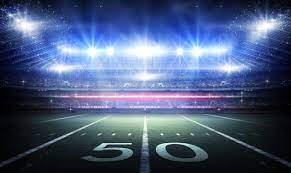

# *Fans of Football*
## How My Love For The Game Shifted To My Love For The Gym  
### The benefits of playing High School football.

#### **Cole J. Ciastko** 2023

For The Love of The Game

“Send them home, **Brescia** '' were the final words my football coach, , said to us as we put our hands into the circle. It was the last game of our high school careers.  Brescia, our Quarterback, did just that with tears streaming down his cheeks. After he said “Go Devils,” everyone became emotional. I remember it so vividly. From the smeared face paint to the noise of the laces being untied for the last time, it was truly moving. When we headed out towards the buses with our equipment on our backs, I took one last glance at the illuminating stadium lights shining down onto the turf, and I took it all in. It was truly the end of one of the best experiences of my life.

Read more about it!
[How It Happened](./how-it-happened.md)

## It will motivate you

Before every game, **Jay Randle** or **Mike Franko**, would tell us “Boys this our time and we don't have much time left.  So, let's go out there and get this win, because it will be one of our last games for the rest of our careers”. Boy, that message sank in and really fired us up. Everyone in the locker room became loud and started banging on the lockers. My blood was racing through my veins. We were ready to go out there and play our hearts out. Due to special moments like these, you become more than just a bunch of guys playing a game, you become “brothers.” That's what made us so good. We knew each other's strengths and weaknesses. We knew everything about each other, and it definitely showed. 

